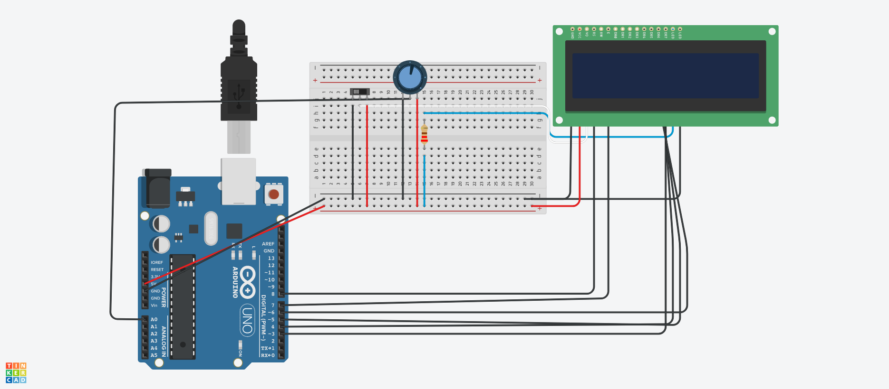

# Flappy Bird

The First few lines of code initializes the led and the sensors and initialize the level

The program continously prints the level on led screen and for every frame check if the player is colliding with any of the block in the level

The Player is controlled by the potentiometer that inputs low high current and here we use a threshold that is roughly the half of the maximum value of potentiometer to define it as top or bottom accordingly.

